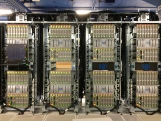

# Hungabee Technical Specifications

* **System Location**: University of Alberta
* **Production Date**: Friday, June 1, 2012
* **Cores**: 2048
* **Login Node**: hungabee.westgrid.ca

## Technical Specifications

**NOTE: This system was “defunded” in Fall 2017. Researchers affiliated with the University of Alberta should contact research.support@ualberta.ca for information about ongoing use of local systems.**

Hungabee comprises an SGI UV100 login node and an SGI UV1000 computational node. The UV1000 is a large cache-coherent non-uniform memory access (ccNUMA) shared-memory multiprocessor machine with 1792 cores (Intel Xeon E7 cpu family) and 14TB of memory.

## Interconnect
Hungabee is not a cluster and is therefore not interconnected in the same sense as a cluster. The UV1000's ccNUMA architecture is implemented using a combination of Intel's Quickpath technology, combined with SGI's NUMAlink 5 and other specialized hardware. The result is that any core is capable of accessing any of the installed memory. However, the speed of access is extremely sensitive to the relative location of processor and memory in the interconnect topology. The closer topologically they are to one another, the better.

## Storage
High performance scratch storage space on the UV1000 is provided by two SGI IS5500 disk arrays containing a total of 120 - 10K RPM SAS drives, providing a total of 53 TB.  The arrays are directly attached to the UV1000 via 8 Fibre Channel connections, for a theoretical maximum bidirectional throughput of 12.8 GBytes/s. This file system is local to the UV1000 and is NFS-exported to the UV100.

As well, a Lustre file system is attached to Hungabee via an InfiniBand interconnect. (This system is also attached to Jasper.)  Housed in an SGI IS16000 disk array with 200 drives, it provides a single 356 TB filesystem.